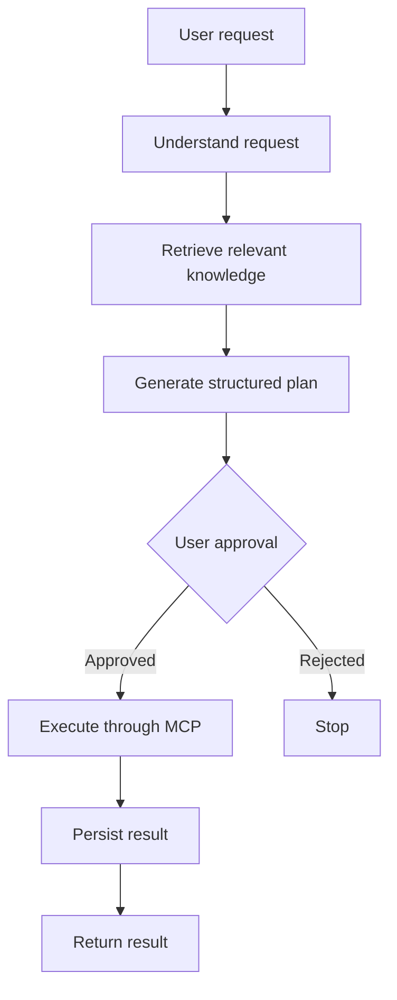

# Buddi — MVP Requirements & TODO

## Functional Requirements

### API

* [x] Implement HTTP server.
* [x] Implement health endpoint. `/healthz` liveness and `/readyz` readiness, which
      pings the database rather than reporting that the process exists.
* [x] Establish API routing. `net/http` method+pattern routing under `/api/v1`,
      operational routes at the root, no third-party router.
* [x] Add request validation and consistent error responses. One error envelope
      with a stable machine code, a message, a field map and a request id; the
      domain owns its validation errors and the API translates them.
* [x] Support request cancellation and timeouts.
* [ ] Add a public note search endpoint. Deliberately deferred: it is the first
      endpoint that would hand a model other people's words, and it needs the
      MCP-era tool surface before it has a caller. Retrieval exists and is
      verified behind the planner.

### Personal Knowledge

* [x] Create knowledge/note model.
* [x] Create and retrieve notes.
* [x] Store document metadata. Title, tags, source, archive state, timestamps.
* [x] Support text/Markdown content.
* [x] Associate knowledge with a user. Every read and write is owner-scoped in SQL.
* [x] Authenticate users. Register, login, refresh rotation, logout, `/auth/me`,
      hashed passwords, hashed refresh tokens.

### RAG

* [x] Implement document chunking. Token-bounded windows with overlap, and a
      note with no text produces no chunks rather than an empty embedding.
* [x] Generate embeddings. `nomic-embed-text` through the Ollama adapter.
* [x] Store embeddings. `vector(768)` in pgvector, one row per chunk, replaced
      rather than appended on re-index.
* [x] Implement semantic similarity search. Cosine distance with the similarity
      floor converted to a distance bound, applied in the same statement as the
      tenant filter.
* [x] Retrieve relevant context for a query.
* [x] Include source information with retrieved context. Each chunk carries its
      note id and ordinal into the planner, and the resulting plan records whether
      it was `grounded`, `no_context` or `ungrounded`.
* [ ] Evaluate retrieval quality with representative queries. Not started. The
      checks so far prove retrieval is correct and tenant-safe, not that the
      ranking is good: no labelled query set exists, so "relevant" is currently
      established by hand on a single note. Needs a small fixture of questions and
      expected notes before the threshold or `top_k` can be tuned against anything.

### LLM

* [x] Define LLM interface.
* [x] Connect a local model. `qwen3:0.6b` through Ollama, not Gemma 4 E2B. The
      original choice was not available locally at the sizes that fit this
      machine's CPU-only runtime, and a 0.6b `qwen3` produced usable plans where a
      same-size Gemma did not. `BUDDI_OLLAMA_MODEL` selects it, so switching is a
      config change.
* [x] Implement model inference.
* [x] Support structured model output.
* [x] Handle model failures and timeouts.
* [x] Evaluate whether reasoning-model thinking tokens are worth their cost.
      The `qwen3` family spends most of a short planner call thinking before it emits
      the answer, and `think:false` cannot be combined with `format`, so
      schema-constrained output has to pay for reasoning it then discards.
      Resolved in practice: Ollama also accepts a graded level in the same field,
      and `think:"low"` measured ~5.0s per plan against ~9.1s for the default on
      the same CPU runtime, with a better title rather than a worse one. The
      planner now requests `think:"low"` with `num_predict=1024`; a budget of 512
      was exhausted by reasoning alone and returned an empty response twice.
      End to end the planner produced 3/3 usable plans in a single attempt with no
      fallbacks at ~10-12s each, discarding ~200-400 reasoning tokens per call.
      So the remaining overhead is a latency and cost problem, not a correctness
      one. Re-check only if planning latency becomes user-visible, or if a stronger
      model is ever adopted. Not a blocker for an MVP that is not being deployed.
* [ ] Resolve relative dates in code rather than in the model. `qwen3:0.6b` cannot
      do date arithmetic: asked to plan something "before Friday" it returned the
      current date, both before and after the prompt was given the current time.
      The planner now drops a due date that is already in the past or that merely
      echoes the request instant, so the failure degrades to "no deadline" instead
      of a wrong one, but the underlying arithmetic still needs doing
      deterministically. Keep `due_at` out of the model schema and resolve
      expressions such as "friday", "tomorrow" or "in three days" in the service.

### Tasks

* [x] Create task model.
* [x] Create task.
* [x] List tasks. Owner-scoped, filterable by status, paginated.
* [x] Update task.
* [x] Complete task.
* [x] Delete task.
* [ ] Support due dates and priorities supplied by the user directly. The columns
      exist and the planner writes them, but the model cannot be trusted to do the
      date arithmetic (see above), so the values it produces are filtered rather
      than resolved. A direct `due_at` from the API is stored as given.

### Agents

* [x] Define agent boundaries.
* [x] Implement orchestrator.
* [x] Implement retrieval workflow.
* [x] Implement planning workflow.
* [x] Implement execution workflow.
* [x] Define structured communication between stages.

    A run is created before planning starts and finalised on a context detached
    from the request, so a client that hangs up leaves a record that reached
    `awaiting_approval` instead of a silent no-op. Planning is synchronous
    (10–20s measured), bounded by `BUDDI_AGENT_PLAN_TIMEOUT`; config rejects a
    timeout at or above `REQUEST_TIMEOUT`, because otherwise the server can
    abandon the response before the outcome is recorded. Live-verified: plan →
    approve → one `tasks.create` tagged with the run, plus reject-cancels,
    double-approve `409`, and cross-user `404`.

    Retrieval is searched before the model is consulted, and the plan records
    which of three states it was written under: `grounded` when at least one of
    the user's own notes reached the prompt, `no_context` when retrieval ran and
    matched nothing, and `ungrounded` when retrieval failed. The distinction is
    the difference between "check your notes" and "report a fault", so it is
    surfaced in the API rather than inferred from the plan.

    Verified end to end against a running server: a run whose note matched at
    cosine similarity 0.68 returned `grounded` with steps quoting the note. That
    check is what exposed the run update never writing `grounding_state`, so every
    run reported `no_context` regardless of what was actually retrieved — a plan
    that read correctly while its own label lied. Fixed, and now guarded by a live
    test that reads the row back, because an in-memory store cannot catch a missing
    column.

### Tools & MCP

* [x] Define tool interface. Name, description, validate, execute. The name is what
      an approval refers to, so it is stored on the approval rather than resolved
      at execution time.
* [x] Implement task tools.
* [x] Implement MCP client. Newline-delimited JSON-RPC 2.0, 8 MiB message limit,
      request-id multiplexing, cancellation, disconnect handling, per-session
      servers over real stdio and in-memory pipes. The pipe client runs an actual
      server process in the same binary; the stdio client is verified against a
      separate compiled server program.
* [x] Implement MCP server for task operations. The task surface itself is reached
      in-process, and the seam is now such that the calendar connector is a real
      MCP server over a pipe. A separate `tasks` binary remains a wiring choice,
      not a missing piece.
* [x] Support tool discovery. Handshake + `tools/list` on connect; the agent
      registers exactly what discovery returns.
* [x] Support tool invocation.
* [x] Validate tool arguments. Validated before an approval is proposed, so the
      user is never shown something that would be rejected on execution. What is
      reviewed is what runs: the exact payload is stored verbatim on the approval.
* [x] Handle MCP failures. Transport failures, malformed responses and tool
      refusals are distinct: a refusal is an ordinary answer a user sees, a
      transport failure is reported as the connector being unreachable.

### Connectors

* [x] Register a connector deterministically. The model emits a bounded intent;
      the registry maps it to a mechanism. Unknown intents become `tasks.create`,
      never a third-party write.
* [x] Keep note content out of outgoing tool arguments. Field-by-field translation
      from plan to payload, plus strict decoding with an exact-key check on the
      connector side. Discovery found a real hole here: `encoding/json` matches
      field names case-insensitively, so a payload carrying both `start_at`
      (approved) and `Start_At` (not) would have let the unapproved value win.
      The decoder now names its keys explicitly.
* [x] Google Calendar connector. `calendar.create_event` (mutating, approvable) and
      `calendar.list_events` (read-only, never behind an approval). The
      mid-transport bytes are asserted equal to the approved bytes over a real
      JSON-RPC pipe; the Google REST request is verified against a fake Google,
      including that a calendar id cannot redirect the write via path traversal.
* [x] Encrypt credentials at rest. AES-256-GCM with a fresh nonce per seal and a
      32-byte key, one row per `(user, provider)`, reconnect upserts. Options in
      by an `OAUTH_ENCRYPTION_KEY`; without it connectors are off and the server
      starts unaffected. The server starts and registers the connector against a
      live database.

### Human Approval

* [x] Distinguish read-only and mutating actions. `Tool` carries `Mutating()`;
      only mutating tools back a proposal, so a read can never sit behind an
      approval prompt and a write can never skip one.
* [x] Require approval for configured mutations.
* [x] Prevent execution without approval. Execution is reachable only by approving
      an existing approval, and the approval is scoped to the run and the step.
* [x] Return execution results to the user.

### Execution

* [x] Generate execution/request IDs. UUID per run, and a request id on every
      response and log record.
* [x] Track agent execution. A run row is written before planning and advanced
      through its lifecycle, so a failed process leaves a readable history rather
      than nothing.
* [x] Track retrieval operations. Per-note `search_state`, attempt count, last
      error, next attempt and lease, plus the claim-and-index loop that drains
      them. What is not yet tracked is which notes a given run actually retrieved:
      the plan records whether context was used, not which chunks.
* [x] Track tool selection and invocation.
* [x] Record failures. On the run, and on the note for indexing failures.
* [x] Make appropriate mutations idempotent. Approving twice returns `409`,
      completing a completed task succeeds, and the double-approve guard is the
      `pending` status in the `WHERE` clause rather than a read-then-write check.

### UI

* [x] Create minimal React/TypeScript application. Vite + React 18, strict
      TypeScript, no router and no UI framework: a login form and a run timeline
      are not worth either. Lives in `buddi-web`, builds clean.
* [x] Connect to API. Typed client over the real endpoints, with one Bearer
      access token and a transparent single retry after a refresh on `401`. The
      dev server proxies `/api` to the API so the browser never needs CORS.
      Verified end to end: register (201) and authenticated `/auth/me` (200) via
      the proxy.
* [x] Implement basic request/chat interface. Superseded by a full chat
      transcript — see 11.3 and 11.4 in `DECISIONS.md`. The goal box and run
      timeline were removed rather than kept alongside the transcript.
* [x] Display responses. Streamed token by token over SSE, with the reasoning
      panel omitted entirely when the model reports none rather than shown empty.
* [x] Display approval requests. Each approval shows its tool, rationale and the
      exact stored argument bytes (`arguments` is rendered as raw JSON), which is
      what the user is being asked to approve. Rendered from each message's own
      `run_id`, so a card cannot outlive or precede the plan it belongs to.
* [x] Allow approval/rejection. Approve and reject resolve the approval and
      replace the run in place, so the timeline reflects the decision without a
      full reload.
* [x] Keep the conversation. Threads list newest-first, messages form a tree via
      `parent_id`, and revising a message inserts a revision that supersedes the
      original rather than overwriting it.
* [x] Dark and light themes, persisted, with a single-scroll layout and a
      collapsible sidebar.
* [x] Google Calendar connection panel. Connect, show status, and disconnect,
      driven by the connection endpoints.

### Known gaps

* [ ] **No user timezone.** Dates and times are handled and stored in UTC, so an
      evening event can render on the wrong local day. This is the most likely
      remaining cause of a "wrong date" report and it is a real bug rather than
      a display artifact. Highest-priority open item.
* [ ] **Relative dates beyond this week.** The planner prompt carries an explicit
      table of the coming week. "In three weeks" or "next month" is still resolved
      by the model. Extending the table is cheap; extending it *and* validating
      it is the correct fix.
* [ ] **The routing table is a snapshot, not a model.** It covers errands and
      appointments. A request naming neither falls through to the model, which is
      the right default but means a new kind of request has no rule until someone
      adds one. Rows are deliberately few and specific.
* [ ] **Retrieval quality is unmeasured.** The path works and is tenant-safe, but
      there is no labelled query set, so the similarity floor and `top_k` are
      reasoned defaults rather than tuned values.
* [ ] **Plan steps still restate the request.** Titles and event descriptions are
      steered towards noun phrases and the event carries its own detail; task steps
      remain close to a paraphrase of the user's own words.

---

# Non-Functional Requirements

### Privacy

* [x] Support local LLM inference.
* [x] Avoid sending personal knowledge to third-party AI services by default.
      Everything runs against a local Ollama, and the note index lives in the
      user's own database.
* [x] Avoid unnecessarily logging sensitive user information. Request ids and
      state names are logged; note content, embeddings and credentials are not.
      Indexing failures log the error, which is why the API deliberately does not
      return `last_index_error` to the caller: it can name internal hosts and URLs.

### Security

* [x] Validate all API input.
* [x] Treat model output as untrusted input. Every field is parsed, bounded and
      normalised by the planner; anything unusable is retried once with the
      specific complaint, then replaced by a deterministic fallback rather than
      trusted. Retrieved note text is fenced as data so a note cannot issue
      instructions to the planner.
* [x] Validate model-generated tool arguments.
* [x] Enforce authorization at the tool/application boundary. Every repository
      method takes the owner and filters in SQL, including the vector search, where
      the filter is part of the ordering statement rather than applied after.
* [x] Require approval for configured mutations.
* [ ] Secure database and model credentials. Configuration reads from the
      environment and nothing is hardcoded, but there is no secret management, no
      rotation, and TLS is not enforced for the database connection.

### Reliability

The system should gracefully handle:

* [x] Database failure. Translated to domain errors rather than leaked as driver
      failures; `/readyz` reports the connection; a failed claim is logged and
      retried on the next pass rather than exiting.
* [x] LLM failure. Recorded on the run as `failed`, or answered by the
      deterministic fallback plan and labelled `plan_fallback`.
* [x] Embedding failure. Does not fail the write. The note is saved, marked
      `pending` or `failed` with the error and attempt count, and the inline path
      is backed by a worker that retries with capped backoff until the attempt
      limit, so a model runtime that is down at write time is not a lost note.
* [x] MCP failure. Refusals are surfaced as ordinary answers; transport failures
      are reported as such; a connector that returns nothing is refused rather
      than reported as success.
* [x] Tool execution failure. Fails the run with the error recorded; the approval
      itself stays resolved rather than being silently retried.
* [x] Invalid model output.
* [x] Invalid tool arguments.
* [x] Missing retrieval context. Degrades to a plan written without context and
      labelled `no_context`, never to a failure, and never presented as grounded.
* [x] Request cancellation. A client that hangs up mid-plan still leaves a run
      that reached `awaiting_approval`, because finalisation runs on a context
      detached from the request.

### Testability

* [x] Unit-test application logic independently of the LLM.
* [x] Mock LLM interactions.
* [x] Mock tool execution.
* [x] Test RAG retrieval independently.
* [x] Test agent workflows with deterministic scenarios.
* [x] Test the persistence layer against a real database. Not asked for, and it is
      the reason two of the bugs found in this project were found at all.

    Unit tests with an in-memory store are blind to anything about the SQL. Both
    bugs found here were invisible to them: an update statement that silently
    dropped two columns, and a queue index missing a state. A fake that stores the
    pointer it was handed agrees with the service by construction, so it cannot
    fail in the way a real store can. The live tests skip without
    `BUDDI_TEST_DATABASE_URI` and use a derived database, so they never touch the
    development one.

    This is the general lesson, recorded as §9.12: test the layer the request
    actually goes through, and for writes that means reading the row back.

### Observability

* [x] Correlate logs with a trace.
* [x] Propagate the trace id onto the run, so a run can be found from its logs.
* [x] Record the outcome of every asynchronous step: indexing per note, runs per
      lifecycle transition, tool execution per approval.
* [x] Log durations readably. `slog` encodes a `time.Duration` as an integer
      nanosecond count, so the worker's lease appeared as `120000000000`. A
      `ReplaceAttr` hook on the log handler renders them as `2m0s`, which matters
      for exactly the values an operator needs to check against the config.
* [ ] Emit retrieval spans and model-invocation spans to a collector. Tracing
      exists and propagates, and the exporters install only when an endpoint is
      configured, so local runs carry no overhead. Not yet instrumented at the
      retrieval or model-call level, so the graph below is partly built by
      inference rather than by spans.
* [ ] Track retrieval latency and hit rate over time. Nothing aggregates these
      yet. Relevant because retrieval quality and the indexing backlog are both
      invisible until something is written down.

### Maintainability

* [x] Keep business logic independent of infrastructure.
* [x] Use interfaces at meaningful boundaries. Ports are declared where the
      application owns the policy: the planner declares what a retriever looks like,
      so it does not import the retrieval package, and `cmd/server` holds the one
      adapter that knows both.
* [x] Keep LLM providers replaceable.
* [x] Keep storage implementations replaceable.
* [x] Avoid premature framework adoption.
* [x] Document significant architectural decisions. `DECISIONS.md`, 9 sections so
      far. §9 covers the retrieval and indexing lifecycle; §9.12 records the rule
      that produced the worst bug in the project, that an update statement lists
      every column the service mutates.

---

# Definition of Done

The MVP should support an end-to-end workflow such as:

> "Based on my existing knowledge and goals, create a two-week Kubernetes learning plan and add the resulting tasks to my task list."

Buddi must be able to:

The MVP succeeds when this workflow demonstrates the integration of **local LLM inference, RAG, agent orchestration, tool use, and MCP** in one functioning system.

## Status Against the Definition of Done

All six capabilities are demonstrated: local inference, RAG, agent orchestration,
tool use, MCP, and approval-gated execution. The "Execute through MCP" step now runs
over a real JSON-RPC session: the calendar connector is an MCP server reached over an
in-process pipe, and an approval-flow integration test asserts that the bytes on the
wire equal the bytes the user approved.

Google credentials are in place and the consent exchange and calendar calls are
live-verified: an event was created successfully. Two caveats remain. Google's
**Testing** mode expires refresh tokens after seven days, so the connector needs
reconnecting roughly weekly until the app is verified. And times are sent in UTC,
which is the one place a still-wrong date can come from (see Known gaps).

The one capability that is demonstrated but not yet trustworthy in the way this
document asks for is retrieval quality. The path works, is tenant-safe, and reports
its own grounding honestly. Whether it retrieves *well* is unmeasured: there is no
labelled query set, so the similarity floor and `top_k` are reasoned defaults rather
than tuned values.

Roughly: the system is functionally complete for a local single-user MVP — a
streaming chat transcript, a grounding-labelled planner, an approval-gated
calendar connector over MCP, and encrypted credentials at rest — minus a
retrieval evaluation and minus user timezone support. The open risks are
"we have not measured this" and "we have not modelled the user's timezone",
not "this is broken".
