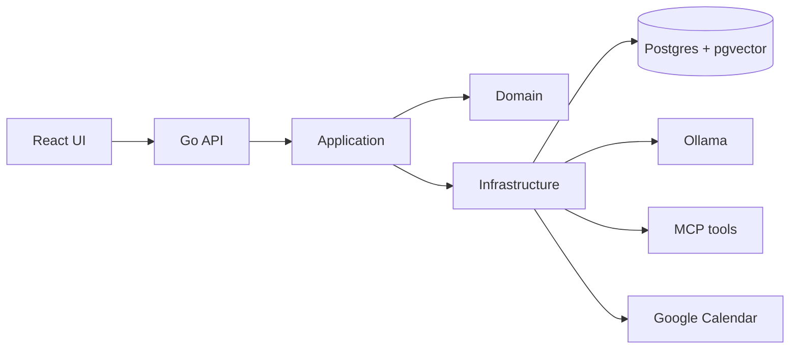

# Buddi

A privacy-oriented personal assistant that runs its intelligence locally. A small
open-weight model on Ollama plans and answers, your own notes provide retrieval
context, and nothing is executed without your approval.

The model and your notes never leave the machine. The only thing that leaves is a
calendar write you approved, and that goes to Google.

Also here: `DECISIONS.md` records why each choice was made, and `MVP_TODO.md`
tracks what is done and what is not. This file is how to run it.

## Architecture

Dependencies point inward. `domain` imports nothing from the layers above it.



| Path | Holds |
| --- | --- |
| `cmd/server` | composition root; the only place everything is wired together |
| `internal/domain` | types and rules. No database, model or network |
| `internal/application` | use cases: planner, chat, agent, notes, tasks, retrieval, oauth |
| `internal/api` | HTTP: routing, decoding, mapping, SSE, error mapping |
| `internal/infrastructure` | the outside world: Postgres, Ollama, Google, MCP |
| `internal/server` | process concerns: timeouts, graceful shutdown |
| `internal/observability` | tracing, off unless configured |
| `buddi-web` | React chat interface |

Four packages carry most behaviour decisions:

| Package | Decides |
| --- | --- |
| `application/planner` | what a request is for, what date it means, when to ask instead |
| `application/chat` | conversation shape, routing, streaming, clarification |
| `application/agent` | which tool carries an intent, and approval |
| `application/calendar` | the calendar connector's contract |

**Stack:** Go, PostgreSQL with pgvector, Ollama, MCP, React + TypeScript.

## Setup

Prerequisites: Docker, Go, Node, and Ollama reachable on `http://127.0.0.1:11434`
(the compose `llm` profile provides it).

```bash
git clone https://github.com/akinolaemmanuel49/buddi.git
cd buddi

make bootstrap     # go mod download + npm install
cp buddi-api/.env.example buddi-api/.env
# fill in SECRET_KEY, JWT_SECRET, and GOOGLE_CLIENT_ID / GOOGLE_CLIENT_SECRET
make models        # pull the models the .env names
make dev           # infra, then the API and the web UI
```

| Service | URL |
| --- | --- |
| API | http://localhost:8000 |
| Web | http://localhost:5173 |
| Ollama | http://localhost:11434 |
| Jaeger | http://localhost:16686 |

Migrations are embedded and applied on startup, so there is no migration step.

`buddi-api/.env` holds secrets and is gitignored; `.env.example` is the template.

## Models

The model is named in `buddi-api/.env` and pulled with `make models`:

```bash
make models                          # pull BUDDI_MODEL and BUDDI_EMBED_MODEL
make models MODEL=qwen3:0.6b         # override on the command line
make model-info                      # what Ollama holds, next to what is configured
```

Ollama caches pulled models in a volume, so this is only needed once per machine.
`make models` is idempotent.

**Switching model** — edit `BUDDI_MODEL`, then `make models`. No code change. Two
settings interact with the choice:

| Setting | Effect |
| --- | --- |
| `BUDDI_OLLAMA_CONTEXT_LENGTH` | KV cache size. The biggest memory lever after the weights |
| `BUDDI_PLANNER_THINK` | Reasoning level. Leave **empty** for a non-thinking instruct model |

The default `qwen3:4b-instruct-2507-q4_K_M` was chosen by measurement, not taste:
`qwen3:0.6b` loses relative dates, and 4B *with thinking* spends its whole token
budget before emitting a plan. Reasoning in `DECISIONS.md` §2.

Dates and times are resolved in code, not by the model — see §14.

## Tests

```bash
make check       # the gate: gofmt, go vet, full suite
make test-cover  # per-package coverage
make test-model  # model output against a live Ollama
make test-live   # integration against a disposable database
```

`make check` is what to run before committing. The default suite is hermetic.

| Tier | Gate | Covers |
| --- | --- | --- |
| Unit | none | validation, routing, encoding, storage, HTTP mapping |
| Model | `make test-model` | dates, time zones, routing, event detail |
| Database | `make test-live` | runs and the note indexing worker |

Coverage is per package, not one total — a single figure hides an untested package.
Current figures from `make test-cover`:

| Package | | Package | |
| --- | --- | --- | --- |
| `application/retrieval` | 92.9% | `infrastructure/mcp` | 77.8% |
| `application/planner` | 90.0% | `application/chat` | 76.0% |
| `infrastructure/googlecalendar` | 88.6% | `api` | 58.3% |
| `application/note` | 87.7% | `infrastructure/llm/ollama` | 56.9% |
| `application/auth` | 80.9% | `infrastructure/persistence/gormdb` | 26.8% |
| `application/task` | 80.8% | `infrastructure/persistence/migrations` | 19.0% |
| `application/oauth` | 80.2% | `observability` | 16.9% |
| `config` | 79.5% | `domain` | 31.5% |
| `application/calendar` | 79.1% | `server` | no tests |
| `application/agent` | 77.1% | `infrastructure/persistence` | no tests |

The low figures are honest and worth knowing rather than hiding:

- **`domain` at 31.5%** — constructors and validation, mostly exercised indirectly.
- **`persistence` at 26.8% and `migrations` at 19%** — thin, because the suites that
  exercise them are the database-gated tier, which the default run skips.
- **`api` at 58.3%** — handlers are covered, error paths less so.
- **`llm/ollama` at 56.9%** — the streaming reader's error branches need a fault the
  fakes do not inject.

### The model tier is not redundant

A fake generator proves the validator *accepts* a correct plan and rejects a wrong
one. It cannot prove the model *produces* one. Every bug here that unit tests could
not see came from a live run:

- a Thursday eight days out for a request for Friday
- a 3pm appointment written as `15:00Z`, reaching the calendar as 4pm
- a doctor's name copied out of a worked example in the prompt

All three are written up in `DECISIONS.md`. The lesson generalises: the model is
untrusted input, and the code that trusts it is where the bugs are.

## Configuration

`buddi-api/.env` is the full list; `.env.example` documents each value. The ones
that change behaviour most:

| Variable | Default | Purpose |
| --- | --- | --- |
| `PORT` | `8000` | API port |
| `BUDDI_MODEL` | see above | the general model |
| `BUDDI_PLANNER_THINK` | empty | reasoning level, or none |
| `BUDDI_OLLAMA_CONTEXT_LENGTH` | `16384` | KV cache size |
| `BUDDI_PLAN_MAX_RETRIES` | `1` | re-ask on a schema-invalid plan |
| `GOOGLE_CLIENT_ID` / `_SECRET` | — | required for calendar |
| `BUDDI_WEB_ORIGIN` | `http://localhost:5173` | where OAuth returns the browser |

### Google Calendar

Calendar writes go through Google's own OAuth flow, so the user sees a consent
screen. Set the client id and secret, and the redirect URI to:

```
http://localhost:8000/api/v1/connections/google_calendar/callback
```

Two things to know. **Testing** mode caps at 100 test users but expires refresh
tokens after **seven days**, so the connector needs reconnecting about weekly until
the app is verified. **In production** mode has no expiry, but needs verification —
for scopes limited to your own data that is a demo video and a privacy policy, with
no review queue.

Full detail in `DECISIONS.md` §10 and §12.