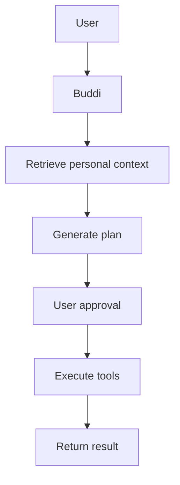
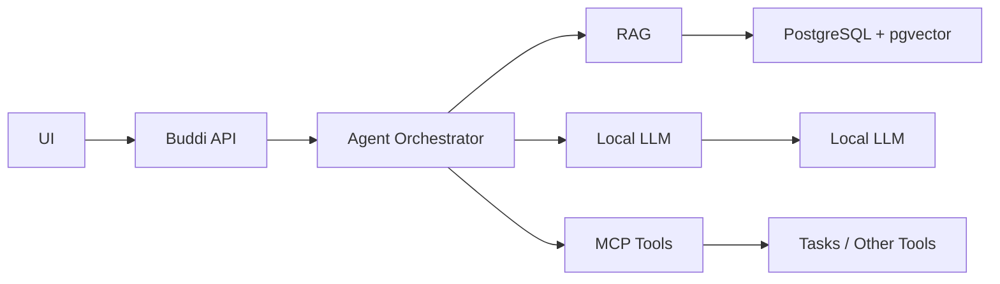
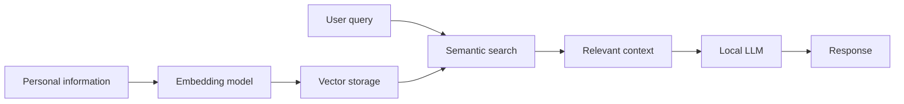

# Buddi

**Buddi** is a privacy-oriented personal life orchestrator designed to help users organize personal information, plan activities, and execute routine tasks.

The project explores how **lightweight local AI models, agents, Retrieval-Augmented Generation (RAG), tools, and the Model Context Protocol (MCP)** can work together to create a useful personal AI system.

The backend/API is the current priority. The UI will initially remain a simple scaffold.

Also in this repository: `DECISIONS.md` records the decisions made and why, and
`MVP_TODO.md` tracks what is left.

## Goals

Buddi is being built around four primary learning goals:

* **Local AI** — use lightweight open-weight models running locally.
* **RAG** — give the model access to relevant personal information without training that information into the model.
* **Agents** — use specialized agents to retrieve information, plan actions, and execute tasks.
* **Tools & MCP** — allow agents to interact with external capabilities through standardized tools.

## MVP

The MVP focuses on a single user's personal knowledge, planning, and task management.

A representative workflow:

> "Based on what you know about me, create a two-week plan for learning Kubernetes and add the resulting tasks to my task list."



The MVP should demonstrate a complete workflow rather than simply provide a conversational interface.

## Architecture

At a high level:



## Technology

The initial stack is:

* **Go** — API and application layer
* **Local LLM (single model)** — `qwen3:0.6b`, the only general-purpose model in
  use, at roughly 2 GB resident with `num_ctx 8192`

  Larger tiers (`qwen3:1.7b`, `gemma4:e2b`) were evaluated and dropped. Without a
  GPU the weights and the KV cache come out of the same RAM, and the extra
  quality is not needed for this MVP. The model is still chosen with the
  `BUDDI_MODEL` environment variable alone, so no code change is needed to switch.
  Embeddings always use `nomic-embed-text` at 768 dimensions.
* **Ollama** — initial local model runtime, containerised
* **PostgreSQL + pgvector** — application data and vector search
* **Supabase** — planned hosted PostgreSQL option
* **MCP** — tool integration
* **React + TypeScript** — minimal UI

The project intentionally avoids adopting a large AI framework initially. The goal is to understand the underlying concepts before introducing additional abstractions.

## Running locally

Postgres, the model runtime and the observability stack all run in Docker, so
nothing needs installing on the host beyond Docker itself.

```bash
# Database only
docker compose up -d db

# Database plus tracing (Jaeger UI on http://localhost:16686)
docker compose --profile obs up -d

# Database plus the local model runtime
docker compose --profile llm up -d ollama
```

Then start the API:

```bash
cd buddi-api
cp .env.example .env      # fill in SECRET_KEY and JWT_SECRET
go run ./cmd/server
```

The API applies pending SQL migrations on startup. They are embedded in the
binary, so there is no separate migration step and no ordering to remember.

### Ollama

Ollama runs in a container on the `llm` profile. It is deliberately not in the
default profile, so `docker compose up -d db` never pulls a multi-gigabyte image
for someone working only on the API.

```bash
docker compose --profile llm up -d ollama

# Pull models into the container, which caches them in the ollamadata volume.
docker compose --profile llm exec ollama ollama pull qwen3:0.6b
docker compose --profile llm exec ollama ollama pull nomic-embed-text
```

Pulled models are kept in the `ollamadata` volume, so recreating the container
does not re-download them.

There is no GPU on the target machine, so the service asks for no accelerator and
inference falls back to the CPU. That shapes the configuration:

- `OLLAMA_CONTEXT_LENGTH=8192` — the KV cache grows with context, and on CPU
  context length is also the dominant latency cost.
- `OLLAMA_KV_CACHE_TYPE=q8_0` — halves KV cache memory, and it does engage on CPU.
- `OLLAMA_MAX_LOADED_MODELS=1` and `OLLAMA_NUM_PARALLEL=1` — RAM and CPU are both
  scarce, and extra resident models or parallel requests only thrash them.
- Flash attention is **not** enabled. It needs a supported accelerator, so on
  CPU it would be a setting that does nothing while implying a speed-up that never
  arrives.

A host-run API reaches the runtime on `http://127.0.0.1:11434`, the published
port. An API running as a container on the same Compose network should use
`http://ollama:11434` instead; `BUDDI_OLLAMA_BASE_URL` covers both.

CPU-only inference is slow. Measured in the `llm` service on a CPU-only machine:

- `qwen3:0.6b` runs at roughly 20–50 tokens/second with `think` disabled, and
  around 2.5 tokens/second while it is thinking.
- The service reported about 7.4 GiB of memory in total, so context length and
  model size are genuinely tight. `qwen3:0.6b` was chosen with that ceiling in
  mind rather than as a stopgap.

Because the `qwen3` family thinks before answering, a planner call spends real
tokens on reasoning before producing anything. Measured over three planning
attempts with `qwen3:0.6b`:

| Approach | Valid output | Avg latency | Tokens spent reasoning |
| --- | --- | --- | --- |
| Schema-constrained (`format`), default thinking | 3/3 | 9.1s | ~359 per plan |
| Schema-constrained (`format`), `think:"low"` | 3/3 | 5.0s | ~216 per plan |
| Schema in the prompt only | 3/3 | 9.4s | included above |

So on this machine schema-constrained output is both more reliable and faster
than describing the schema in prose, and most of the tokens it spends are
reasoning that is then discarded.

Ollama accepts a graded level in the same `think` field that takes a boolean, so
`think:"low"` is the way to cap that cost. It works *with* `format`, which matters
because `think:false` does not, and it was not merely cheaper here: it also
produced a better title than the default. The planner requests it, and the
end-to-end run produced 3/3 usable plans in a single attempt with no fallbacks at
roughly 10–12s each.

Two things follow for the planner:

- `think:false` is much faster still, but it cannot be combined with `format`, so
  schema-constrained output has to budget for reasoning rather than suppressing
  it. Budget `num_predict` generously or a plan silently comes back empty; at 512
  tokens a planning call twice exhausted the budget on reasoning and returned
  nothing at all. The planner uses 1024.
- A schema guarantees the *shape* of a plan, not its quality. The same run
  produced both `Buy Semi-Skimmed Milk Before Friday` and a run-on title that
  swallowed the whole request, so titles still need trimming and validation.

One limitation is worth knowing about: this model cannot do date arithmetic.
Asked to plan something "before Friday" it returned the current date, both before
and after the prompt was given the current time. The planner therefore drops a due
date that has already passed or that merely echoes the request instant, so the
failure degrades to "no deadline" rather than a wrong one, but relative dates
still need resolving in code rather than in the model.

`format` must be sent as a nested JSON Schema object in the request body, not as
a string containing JSON.

To stop the runtime from consuming the whole machine, cap it after starting:

```bash
docker update --memory 6g buddi-ollama
```

### Telemetry

Tracing is off unless `OTEL_EXPORTER_OTLP_ENDPOINT` is set, and no exporter is
installed when it is empty. When enabled, every request span is correlated with
the request log line through the `trace_id` field, and `agent_runs.trace_id`
stores the same value so a run can be found in the tracing backend from the
database.

## The Agent

The run is the unit of work. It is created **before** planning starts, so a
request that dies mid-plan still leaves a record to inspect rather than a
vanished side effect.

```
POST /api/v1/agent/runs            plan a goal, return the proposed actions
POST /api/v1/agent/approvals/:id/approve
POST /api/v1/agent/approvals/:id/reject
POST /api/v1/agent/runs/:id/cancel
GET  /api/v1/agent/runs/:id
GET  /api/v1/agent/runs            list, filterable by ?status=
```

| Status | Meaning |
| --- | --- |
| `planning` | the model is working; no user action possible yet |
| `awaiting_approval` | proposed actions are waiting on a decision |
| `executing` | approved, tools are running |
| `completed` | tools finished and the result is recorded |
| `failed` | planning or execution failed; the error is stored on the run |
| `cancelled` | rejected or explicitly cancelled; nothing was applied |

Every run carries `plan_fallback`. It is `false` for a model-produced plan and
`true` when the plan is the deterministic fallback described below, so a salvaged
plan is never presented as one the model reasoned about.

Planning is answered **synchronously**: `POST /agent/runs` blocks for the model.
Measured 10–20s on CPU with `qwen3:0.6b`. That has two consequences worth knowing:

- `BUDDI_AGENT_PLAN_TIMEOUT` (default 45s) bounds the model call, and config
  validation rejects a value at or above `REQUEST_TIMEOUT` (60s). Without that
  guard the server can abandon the response mid-plan and never record an outcome.
  A planning timeout answers `504 gateway_timeout` and leaves a `failed` run with
  the cause recorded. It deliberately does **not** fall back to a generated plan:
  the model never answered, so nothing was planned.
- The call is not idempotent. A client that times out and retries creates a
  second run, because the first may still be planning.

The run is finalised on a context detached from the request, so a client that
hangs up does not cancel the run — it still reaches `awaiting_approval`, and the
caller can pick it up from `GET /agent/runs/:id`. This is deliberate: cancelling
on disconnect would mean the work silently never happened.

Rejecting an approval cancels the whole run and applies nothing, rather than
skipping one step and continuing with the rest. Approving twice returns `409`.
Every route is scoped by user, so another user gets `404`, not `403` — the run's
existence is itself private.

An approved run executes `tasks.create` in-process through the `Tool` interface.
That interface is the seam for MCP: the orchestration around it does not change
when the implementation becomes a client. Approval is per tool call, so the same
approval record generalises to several calls without changing the endpoint shape.

One measured model weakness is visible here: because the prompt has to state the
current time, `qwen3:0.6b` sometimes pastes that timestamp into the title or a
step. The prompt forbids it explicitly and the live smoke test asserts titles stay
clean, but steps still occasionally carry one.

## RAG and Personal Knowledge

Buddi keeps personal information in application storage rather than embedding it into the model itself.



### How it works

Notes are embedded as they are written, chunked into ~500-token windows with 50
tokens of overlap so a sentence spanning a boundary is still retrievable from one
side of it. Each chunk carries its owner's `user_id`, and every search filters on
it in SQL rather than after the fact — filtering later would put another user's
notes in the process before discarding them, and would let `top_k` fill up with
rows belonging to somebody else.

Planning searches a user's notes for the request and passes what it finds to the
model as fenced reference material. Retrieved text is user-controlled, so it is
delivered as data with an explicit boundary rather than as instructions. Every plan
records how it was grounded:

| State | Meaning |
| --- | --- |
| `grounded` | At least one retrieved note reached the prompt |
| `no_context` | Retrieval ran and matched nothing |
| `ungrounded` | Retrieval failed and the plan was written without context |

Recording it means "the plan used your notes" and "the model invented this" stay
distinguishable after the fact, instead of being a matter of trust.

There is no public search endpoint yet. Retrieval exists to ground plans; exposing
it directly is not part of the current build.

### Staying searchable

A note that has been written is queued for indexing in the same database statement
that stores it, so a saved note cannot be silently unsearchable. The note row
carries `search_state`, the attempt count, the last error, and when it is next due.

Indexing happens inline on save, so a note is searchable by the time the response
returns, and also in a background worker in the same process. The worker's job is
what inline cannot finish: a model runtime that was down, a model still loading, or
a process that died mid-note. It claims work with a single locking statement and
holds a lease, so two workers never embed the same note, and a note whose worker
died is picked up again once its lease expires. Attempts back off from one minute
to thirty and stop after five, leaving the note marked `failed` with its reason
recorded rather than retried forever against a runtime that cannot succeed.

### Configuration

| Variable | Default | Purpose |
| --- | --- | --- |
| `EMBED_DIMENSIONS` | `768` | Must match the fixed vector column width |
| `CHUNK_TOKENS` | `500` | Tokens per chunk |
| `CHUNK_OVERLAP` | `50` | Tokens repeated into the next chunk |
| `EMBED_MAX_TOKENS` | `8192` | The embedder's own input ceiling |
| `RETRIEVAL_TOP_K` | `5` | Chunks retrieved per planning request |
| `RETRIEVAL_MIN_SIMILARITY` | `0.3` | Cosine similarity floor, `-1` to `1` |
| `INDEX_BATCH_SIZE` | `20` | Notes claimed per worker pass |
| `INDEX_INTERVAL` | `5s` | Wait when the queue is empty |
| `INDEX_LEASE` | `2m` | How long a claimed note stays claimed |

`INDEX_LEASE` must exceed the slowest embedding call the runtime can make,
otherwise two workers index the same note; startup rejects a lease that is not
longer than `INDEX_INTERVAL`.

The reasoning behind these choices, including the ones that were reversed, is in
`DECISIONS.md` section 9.

## Fine-Tuning

Fine-tuning is **not part of the initial MVP**.

It may be explored later to determine whether a customized model improves Buddi-specific behavior such as structured outputs, planning, or tool selection.

Personal information should generally remain external to the model and be supplied through retrieval.

## MVP Definition of Done

The MVP is complete when Buddi can:

1. Receive a natural-language request.
2. Retrieve relevant personal information.
3. Reason over that information.
4. Generate a structured plan.
5. Present proposed actions to the user.
6. Obtain approval for mutating actions.
7. Execute an appropriate tool through MCP. — **in-process `Tool`, MCP seam in place**
8. Persist the result.
9. Return the result to the user.
10. Provide enough execution information to debug the workflow.

The primary objective is to demonstrate a coherent **local AI + RAG + agents + tools + MCP** system.
